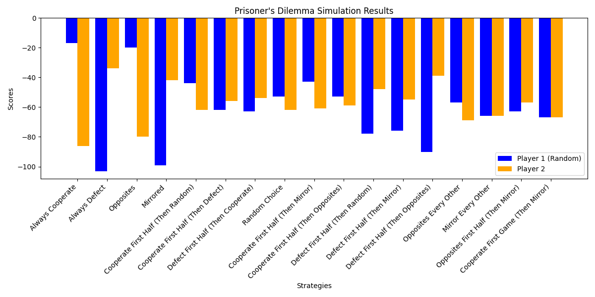

# GameTheory
# Prisoner's Dilemma Simulation

This project simulates the Prisoner's Dilemma for various strategies over multiple rounds and visualizes the results using a bar chart.

## Overview
The **Prisoner's Dilemma** is a game theory problem where two players independently choose to either "cooperate" or "defect". The outcomes for each choice are determined as follows:

| Player A Choice | Player B Choice | Outcome (Player A, Player B) |
|-----------------|-----------------|-----------------------------|
| Cooperate       | Cooperate       | (-1, -1)                   |
| Cooperate       | Defect          | (-3, 0)                    |
| Defect          | Cooperate       | (0, -3)                    |
| Defect          | Defect          | (-2, -2)                   |

The goal of the simulation is to test various strategies for Player B against a random choice strategy for Player A and compare their scores.

## Strategies
The following strategies are implemented for Player B:

1. **Always Cooperate**: Always chooses "cooperate".
2. **Always Defect**: Always chooses "defect".
3. **Opposites**: Chooses the opposite of Player A's last choice.
4. **Mirrored**: Mimics Player A's last choice.
5. **Cooperate First Half (Then Random)**: Cooperates for the first 20 rounds, then chooses randomly.
6. **Cooperate First Half (Then Defect)**: Cooperates for the first 20 rounds, then always defects.
7. **Defect First Half (Then Cooperate)**: Defects for the first 20 rounds, then always cooperates.
8. **Random Choice**: Randomly chooses between "cooperate" and "defect".
9. **Cooperate First Half (Then Mirror)**: Cooperates for the first 20 rounds, then mirrors Player A's choice.
10. **Cooperate First Half (Then Opposites)**: Cooperates for the first 20 rounds, then chooses the opposite of Player A's choice.
11. **Defect First Half (Then Random)**: Defects for the first 20 rounds, then chooses randomly.
12. **Defect First Half (Then Mirror)**: Defects for the first 20 rounds, then mirrors Player A's choice.
13. **Defect First Half (Then Opposites)**: Defects for the first 20 rounds, then chooses the opposite of Player A's choice.
14. **Opposites Every Other**: Alternates between "opposites" and repeating the previous choice.
15. **Mirror Every Other**: Alternates between "mirroring" and repeating the previous choice.
16. **Opposites First Half (Then Mirror)**: Chooses "opposites" for the first 20 rounds, then mirrors Player A's choice.
17. **Cooperate First Game (Then Mirror)**: Cooperates in the first round, then mirrors Player A's choice.

## Code Breakdown

### Core Functions
- `prisoners_dilemma(player_a, player_b)`: Determines the outcome based on the choices of Player A and Player B.
- `plot_results(results)`: Visualizes the results of the simulation as a bar chart using `matplotlib`.
- `Players_To_Test`: Funtions that implement stratgies used (strategies like `cooperate`, `defect`, `mirror`, `opposites`, `rand_option`).

### Simulation
- Each strategy is tested over 40 rounds against Player A, who makes random choices.
- Scores for both players are accumulated and stored in the `results` list.

### Visualization
- A bar chart is created to compare Player 1's (random choice) and Player 2's (strategy) scores.
- Strategies are displayed on the x-axis, and scores are represented by blue and orange bars.

## How to Run
1. Install the required dependencies:
   ```bash
   pip install matplotlib
   ```
2. Run the script to simulate the game and display the results.

## Example Output
The program generates a bar chart comparing scores for each strategy. For example:



## Dependencies
- Python 3.x
- `matplotlib`

